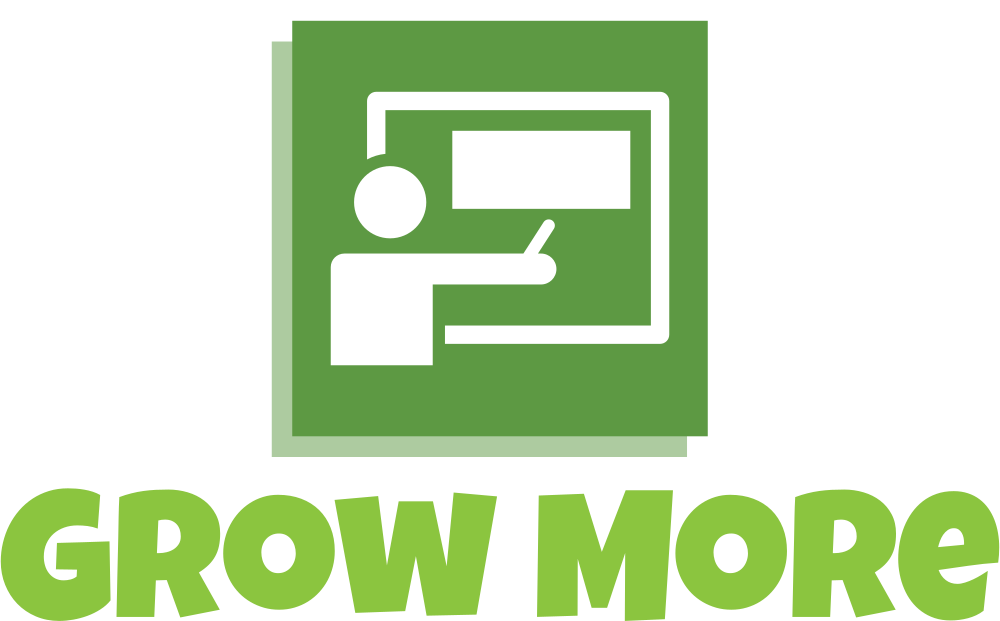

An adaptive e-learning platform

### <a href="https://growmore.onrender.com">Live Backend Url</a>
### <a href="https://growmoreai.web.app">Live Frontend Url</a>

## Setup Guide
If you want to setup the project locally. follow below steps

### Backend Setup
1. Clone backend code `git clone https://github.com/voltShavika/growmore_backend`
2. Install dependencies by running `npm install`
3. Change your localhost mongodb config in `growmore_backend/db.js`
4. run project by `node app.js`
5. Now you server should be running on `http://localhost/` by default port 80. Change it if you want in `app.js`

### Frontend Setup
1. Clone frontend code by `git clone https://github.com/voltShavika/growmore`
2. Install dependencies by running `npm install`
3. By default all api endpoints are directing to Live Deployed Code. In case you want to change it. just replace `host` with your localhost in `growmore/src/api.js`
4. Run frontend server by `npm start`
5. Now frontend should be running on `localhost:3000`
